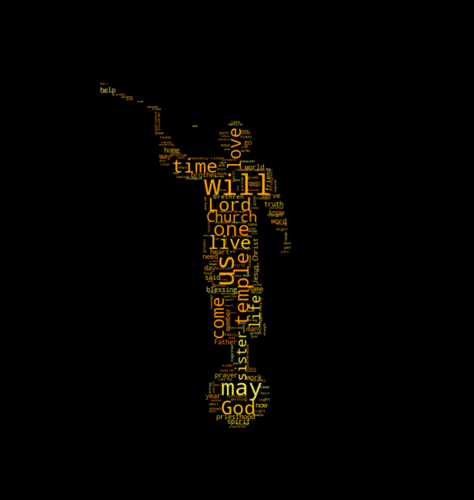

# gen-conf-exp
Final Project for STAT 426. This project includes obtaining General Conference discourses from the Church of Jesus Christ of Latter Day Saint website and uses modern statistical methods to analyze text.  

As of now this repository focuses on classifying between authors using sklearn's Naive Bayes classifier for multinomial models (MultinomialNB), Random Forest Classifier (RandomForestClassifier), and AdaBoost classifier (AdaBoostClassifier). In the future this might include more *see section titled **Further Exploration** at the end of this document*.

President Nelson Word Cloud

President Monson Word Cloud

## Introduction
The Church of Jesus Christ of Latter Day Saints has a worldwide influence. The leaders are considered by members to be prophets and apostles of modern times. They give talks every April and October at meetings called General Conference. I have a passion for languages, both natural and computational, and this massive corpus of text from the discourse is sparked my interest. The basis of this process is to answer the following questions. 
How are unique are the prophets and apostles?

## Data
The data used in this project comes from [the church's website](https://www.churchofjesuschrist.org/general-conference/conferences?lang=eng) 
The functions used in order to get this data can be found in the file titled ***get_data***. A summary of the functions in this file can be found below.

`def get_author_body(url):`
- input: url of specific discourse
- output: if possible returns three strings author's name, conference date (formated 'YYYY/MM'), and transcript of discourse

`def get_talk_urls_from_conf(url):`
- input: url of specific conference
- output: returns list of links to each individual talk at that particualr conferene (these links can then be used in the function `def get_author_body(url):`)

`def get_all_conf_urls(url):`
input: designed to take in [this url](https://www.churchofjesuschrist.org/general-conference/conferences?lang=eng)  
output: returns list of links to all the general conferences (these links can then be used in the function `def get_talk_urls_from_conf(url):`)

`christmas_nelson_url` = [link to chritmas devotional given by President Russel M. Nelson](https://www.churchofjesuschrist.org/broadcasts/article/christmas-devotional/2018/12/four-gifts-that-jesus-christ-offers-to-you?lang=eng)
This is not a function, but I wanted to get a talk by one of the speakers at general conference to see if the classifiers could predict the author on a non-general conference talk. I did a bit of manually cleaning up to remove the references at the bottom of the talk. For convenience, the cleaned data for this talk can be found in the file *nelson_christmas.csv*

Also for convenience and future use, I exported the data into cvs files. *cd_2011_2020_data.csv* contains all the conference talks that had transcripts for the past 10 years (2011 to 2020). *cd_all_2020_data.csv* contains all the conferences that could currently be found on the site (1971 to 2020). These can be easily imported into an R program or a Python program as a data frame with the columns being author, date, text/transcript.

The *cd_2011_2020_data.csv*  contains 755 talks
The *cd_all_2020_data.csv* contains 4593 talks

*Note: as the website to do change their chances that the above functions might break in the future but hopefully the functions above can give a good start into getting discourses from General Conference*

*Note: the church has a lot more talks that go back into the 1800s, these are probably in some database which if you give them permission could be easily accessed*

## Methods & Results
**The methods and results can be found mainly in the following 2 files.**

*NelsonMonsonClassifier*

*ClassifierMultiplePeoplePast10Year*

**The methods in these three files all follow the same pattern.** 
- The date is imported from the dots CSV files
- A subsection of the data is chosen (based off of authors of interest)
- The transcripts are prepared/cleaned (vectorized and lematized)
- The data is split into train and test groups

- A Classifier is chosen. I used three different classifiers: 
  - sklearn's Naive Bayes classifier for multinomial models (MultinomialNB)
  - Random Forest Classifier (RandomForestClassifier)
  - AdaBoost classifier (AdaBoostClassifier)
-  Preformance in printed out

*extra steps:*
- Import christmas devotional from *nelson_christmas.csv*
- Prepare transcript (vectorize and lematize version) I name this `nelson_christmas_vector`.
- Get model to predict author. (It should predict Nelson)

- Repeat with other classifier

### Results

#### NelsonMonsonClassifier
The Naive Bayes classifier for multinomial models performed the best in the section. I used talks from President Nelson and Monson and the last 10 years. All of the models predicted the Christmas devotional by President Nelson correctly. I also tried all of these lemmatizing the the talks, but it only resulted in minimal changes in performance. 

- confusion matrix of best model (Naive Bayes classifier) on test set

[13,  0]

[ 1, 11]

###### Naive Bayes classifier
- accuracy score: 0.96
- f1_score: 0.96

###### Random Forest classifier (with `'max_depth': 100, 'n_estimators': 250`)
- accuracy score: 0.92
- f1_score: 0.90

###### Adaboost classifier (with `'learning_rate': .5, 'n_estimators': 700`)
- accuracy score: 0.92
- f1_score: 0.92
(I experimented a bit with the learning rate and number of estimators. If you have a lot of estimators or lower the learning rate a bit the performance becomes as good as the MultinomialNB model.)

#### ClassifierMultiplePeoplePast10Year
This part tries to build a model that can identify between Nelson, Monson, Uchtdorf, Jeff R. Holland and Bednar. Lemon ties in the talks did improve performance considerably. The Naive Bayes classifier was worse that classify in between these five authors and incorrectly classified the Christmas devotional as Uchtdorf instead of Nelson.

- confusion matrix of best model (Random Forest classifier) on test set

['Bednar' 'Holland' 'Monson' 'Nelson' 'Uchtdorf']

[ 5,  0,  0,  1,  0]

[ 0,  3,  1,  0,  2]

[ 0,  0, 12,  0,  1]

[ 0,  0,  2,  8,  2]

[ 0,  0,  0,  0, 14]

###### Naive Bayes classifier
-  accuracy score: 0.549

###### Random Forest classifier (with `'max_depth': 100, 'n_estimators': 500`)
-  accuracy score: 0.82

###### Adaboost classifier (with `'learning_rate': 1, 'n_estimators': 500`)
-  accuracy score: 0.78

## Conclusions
- When only deciding between two options the Naive Bayes classifier for multinomial models performs the best with a very high accuracy. 
- With classifying between multiple authors the Random Forest classifier and  Adaboost classifier performed much better than the multinomial classifier. There was not a clear better model between the Random Forest and Adaboost classifiers. Depending on the parameters chosen, the random state, and authors chosen, the one would preform better than the other.
- All of the models performed fairly well, but they all showed the trend that when trying to classify between multiple authors performance decreased.

To answer the original question, overall, the speakers at General Conference are unique enough to be able to classify fairly well between them. The performance of the classification depends on the speakers, the number of speakers, and the model. I was very impressed to see that these classifiers could also predict the author of a talk that did not come from general conference. This shows that there is possibly an underlying unique style of writing or word a choice between the leaders of the church of Jesus Christ of latter-day Saints.

## Further Exploration
Due to time limitations I did not get to incorporate many of the things that I wanted to. Here were some of my other ideas:

Would adding a sentiment feature or a talk length feature improve performance?

Would analyzing the reference in the talks the number of them and the source add any useful information? (for example maybe one author sites the old testament a lot more frequently and another author cites the book of Mormon more frequently)

Could we look at just a functional data analysis of the sentiment across the speeches? This is a lot more complicated of an idea but the idea is to have a sentiment function for each talk that would be based off of possibly the sentiment values of each sentence or paragraph. Using functional data analysis we could possibly classify authors solely based off of the way the sentiment changes throughout the talk. (A possible limitation of this would be that functional data analysis is best done when the functions are of the same domain. I've already started working on a solution for this and it is in the file called *SentMultiplePeoplePast10Years*)

Would using a neural network perform better than the models I used? (Ive already starting working on this in the file callled *ClassifierNN*, but did not make it very far.)

Could we do some type of clustering analysis to see how topics have changed over the general conference is from April 1971 to Oct. 2020? (for example President Hinckley focused on food storage more than some others)

Since I have a love for languages, I also thought about the translations of these talks. The majority of these talks have very accurate professional translations in other languages. How would the sentiment of the English version compared to the Spanish, Japanese, Portuguese, .. versions. We couldn't necessarily do an analysis of the accuracy of the sentiment analyzer that we use, but we could see how precise they are by comparing one to another. So ... Using common sentiment analyzers of other languages, maybe [Portuguese](https://link.springer.com/article/10.1007/s10462-020-09870-1), how does it compare to english? For languages that don't have very precise sentiment analyzers could we use these translations to develop better ones?

#### Wanna mess around with it yourself?
Download/Clone repository
Make sure you have all the needed packages installed. (If not a simple pip install *package-name* should do the trick)

Probably the main area of interest would be into looking into different authors. To to that find the line of code below and try replacing the names for other people. For example:
`talks = gc_data[gc_data.author.str.contains('Nelson|Monson|Hinckley|Benson', regex=True)]`

Could be changed to:
`talks = gc_data[gc_data.author.str.contains('R. Holland|Uchtdorf|Bednar', regex=True)]`

Note: Look out for authors who have the same last name. For example you might need to include a middle initial such at `R. Holland` instead of just `Holland`.

Note: The code for generating the word cloud graphics at the top of this document can be found at the bottom of the NelsonMonsonClassifier.

